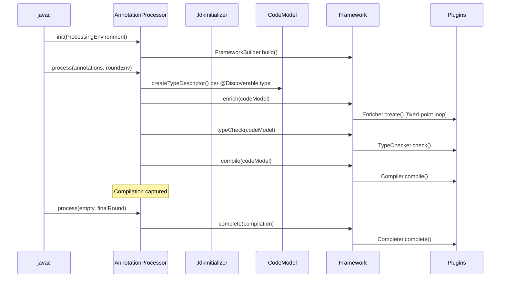
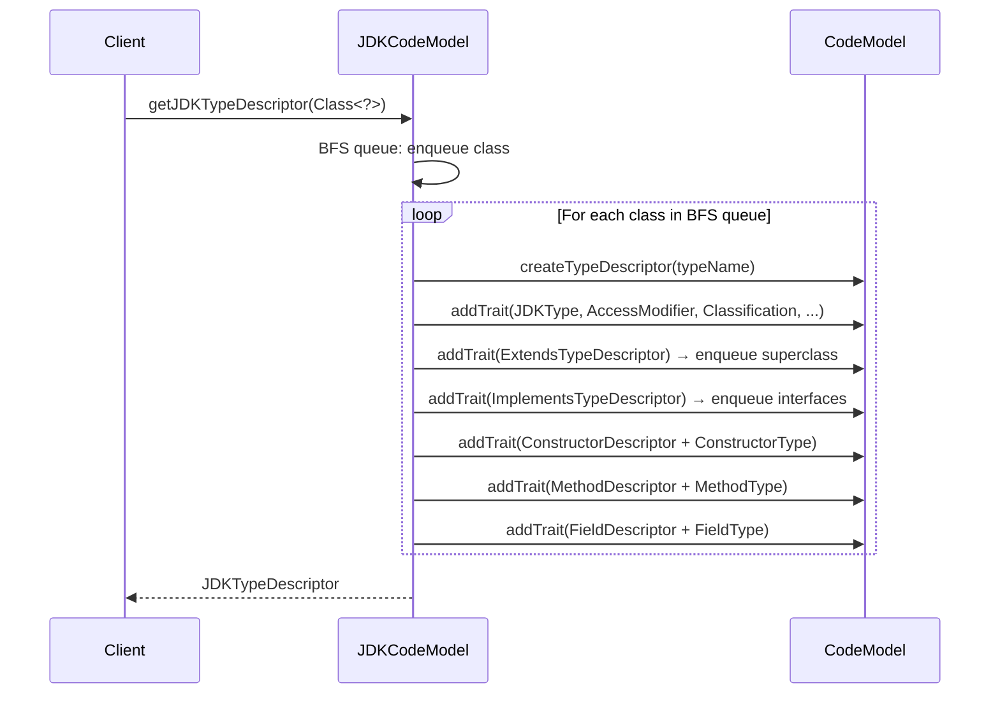

# Codebase Map — `codemodel.build`

> Auto-generated by Cartographer. Last mapped: 2026-04-20

## System Overview

`codemodel.build` is a **language-agnostic, paradigm-neutral Java code model framework** built by Workday, Inc. It provides a structured, serializable representation of software systems that can be inspected, enriched, and transformed. The framework can populate a code model from either compiled classes (via reflection) or `.java` source files (via javac). Downstream consumers use it to build annotation processors, code generators, and static analysis tools.

**Stack:** Java 25, Jakarta Inject, Maven, custom marshalling framework (`build.base:base-marshalling`), Pratt-parser via `build.base:base-parsing`, JSR-330 DI implementation

```mermaid
graph TB
    subgraph Foundation
        F[codemodel-foundation]
    end
    subgraph Domain Models
        EXPR[expression-codemodel]
        HIER[hierarchical-codemodel]
        IMP[imperative-codemodel]
        OO[objectoriented-codemodel]
    end
    subgraph JDK Integration
        JDK[jdk-codemodel]
        DISC[jdk-annotation-discovery]
        PROC[jdk-annotation-processor]
    end
    subgraph Framework
        FW[codemodel-framework]
        FWB[codemodel-framework-builder]
    end
    subgraph DI
        DI[dependency-injection]
    end

    F --> EXPR
    F --> HIER
    EXPR --> IMP
    HIER --> OO
    IMP --> OO
    OO --> JDK
    JDK --> DI
    FW --> FWB
    DI --> FWB
    JDK --> PROC
    FWB --> PROC
    DISC --> PROC
```

---

## Directory Structure

```
codemodel.build/
├── codemodel-foundation/          # Core abstractions: TypeDescriptor, TypeUsage, Trait system, naming
├── expression-codemodel/          # Expression AST nodes + Pratt-parser (now via base-parsing)
├── hierarchical-codemodel/        # Type hierarchy: parent/child/ancestor/descendant
├── imperative-codemodel/          # Statement AST nodes: Block, If, While, Return, Assignment
├── objectoriented-codemodel/      # OOP traits: fields, methods, constructors, access modifiers
├── jdk-codemodel/                 # JDK-backed impl: reflection + javac source parsing + AST conversion
├── dependency-injection/          # Custom JSR-330 DI implementation built on jdk-codemodel
├── codemodel-framework/           # Pipeline interface: Enricher, TypeChecker, Compiler, Completer
├── codemodel-framework-builder/   # Concrete pipeline: FrameworkBuilder, InternalFramework
├── jdk-annotation-discovery/      # SPI: AnnotationDiscovery + @Discoverable annotation
├── jdk-annotation-processor/      # javax.annotation.processing.Processor driving the full pipeline
├── config/checkstyle/             # Google Checkstyle config
└── pom.xml                        # Root aggregator POM (Java 25, version ${revision})
```

---

## Module Guide

### `codemodel-foundation`

**Purpose:** The substrate for everything else. Provides the `CodeModel` registry, `TypeDescriptor`/`ModuleDescriptor`/`NamespaceDescriptor` model nodes, the `Trait`/`Traitable` system for extensible metadata, all naming types, and marshalling conventions.

**Entry point:** `build.codemodel.foundation.CodeModel`

**Key files:**

| File | Purpose |
|------|---------|
| `CodeModel` | Root registry: creates/queries `TypeDescriptor`s, `ModuleDescriptor`s, `NamespaceDescriptor`s |
| `AbstractCodeModel` | `ConcurrentHashMap`-backed impl with `HeapBasedCompositeIndex` for `Queryable.match()` |
| `ConceptualCodeModel` | Default concrete impl; `@Inject`-annotated ctor; self-registers with `Marshalling` |
| `CodeModelTraitable` | Internal trait bag: enforces `@Singular`/`@NonSingular` cardinality, indexes into heap |
| `TypeDescriptor` | Named-type definition node; `Traitable` + `Dependent` |
| `PolymorphicTypeDescriptor` | Default open type descriptor; all semantics from traits |
| `TypeUsage` | Type reference node (how a type is *used*); hierarchy of 11 concrete types |
| `AnnotationTypeUsage` | Annotation usage; also a `Trait`, allowing annotations on any `TypeUsage` |
| `TypeName` | Fully qualified type identifier; format `[module/][namespace.]simpleName` or `[enclosingType:]...` |
| `NameProvider` | Factory/flyweight for all name value objects; `CachingNameProvider` wraps `NonCachingNameProvider` |
| `CallableDescriptor` | Trait interface for method/function definitions on a `TypeDescriptor` |

**TypeUsage hierarchy:**
```
TypeUsage
├── AbstractNamedTypeUsage
│   ├── SpecificTypeUsage       — raw non-parameterized reference ("String")
│   ├── VoidTypeUsage           — the void type
│   ├── UnknownTypeUsage        — placeholder when type cannot be resolved
│   ├── GenericTypeUsage        — parameterized type (List<String>)
│   ├── AnnotationTypeUsage     — annotation use; also implements Trait
│   ├── TypeVariableUsage       — named type variable T with bounds
│   └── WildcardTypeUsage       — the "?" wildcard (TypeName = "wildcard")
├── ArrayTypeUsage              — wraps a component TypeUsage
├── UnionTypeUsage              — set joined by |
└── IntersectionTypeUsage       — set joined by &
```

**Trait/Traitable system:**
- `@Singular` — at most one instance of this trait class per `Traitable` (enforced at `addTrait`)
- `@NonSingular` — many instances allowed (default)
- Registration class is determined by walking the class hierarchy for either annotation; cached JVM-globally
- `TraitAware` — lifecycle callbacks `onAddedTrait`/`onRemovedTrait`

**Naming types:** `IrreducibleName` (leaf), `Namespace` (dot-hierarchy), `ModuleName` (flat dot-list), `TypeName` (composite of all). All equality is string-based on `toString()`.

**Marshalling convention** (used across all modules):
```java
// Serialize
@Marshal
public void destructor(Marshaller m, Out<X> f1) { f1.set(this.f1); }

// Deserialize
@Unmarshal
public MyClass(@Bound CodeModel cm, Marshaller m, X f1) { this.f1 = f1; }
```
Static initializers call `Marshalling.register(MyClass.class, MethodHandles.lookup())`.

**Pattern matching sub-package** (`usage.pattern`): `TypeUsagePattern<T,M>` / `TypeUsageMatch<T>` — monadic matchers for `GenericTypeUsage`, `AnnotationTypeUsage`, `OptionalTypeUsage`, etc.

**Dependencies:** `base-foundation`, `base-marshalling`, `base-telemetry-foundation`, `jakarta.inject-api`
**Depended on by:** every other module

---

### `expression-codemodel`

**Purpose:** All expression AST nodes (literals, variables, arithmetic, logical, comparison, function calls, casts, templates) plus the bridge to the external Pratt-parser.

> **Note:** The parsing infrastructure was migrated from an internal implementation to the external `build.base:base-parsing` library (PR #24). The Pratt-parser is no longer part of this module's source.

**Entry points:** `build.codemodel.expression.Expressions` (factory facade), `build.codemodel.expression.Expression` (root interface)

**Key files:**

| File | Purpose |
|------|---------|
| `Expression` | Root interface; `Traitable`; exposes `Optional<TypeUsage> type()` |
| `AbstractExpression` | Base: wires `type()` through the `ExpressionType` trait |
| `ExpressionType` | `@Singular` `Trait` carrying resolved `TypeUsage`; attached by enrichers post-construction |
| `Expressions` | `CodeModel`-bound factory: `valueOf`, `and/or/not`, `equalTo/lessThan`, `add/subtract/…`, `apply`, `variableOf`, `cast` |
| `Literal<T>` | Non-null literal; auto-derives `TypeUsage` from value's class |
| `VariableUsage` | Named variable reference, optionally typed |
| `FunctionUsage` | Function application: `FunctionName` + argument list |
| `FunctionDescriptor` | Descriptor for a function definition (`CallableDescriptor`) |
| `Cast` | Type-cast: `type()` always present, equals `targetType` |
| `TemplateExpression` | String template (list of sub-expressions); always typed as `String` |

**Expression node hierarchy:**
```
Expression
├── Literal<T> → BooleanLiteral, NumericLiteral, StringLiteral
├── VariableUsage
├── FunctionUsage
├── Cast
├── TemplateExpression
├── ArithmeticExpression
│   ├── Binary: Addition, Subtraction, Multiplication, Division, Modulo, Exponent
│   └── Unary:  Negative
└── LogicalExpression
    ├── Binary: Conjunction, Disjunction, ExclusiveDisjunction, Then
    ├── Unary:  Negation (NOT)
    └── ComparisonExpression: EqualTo, NotEqualTo, LessThan, LessThanOrEqualTo,
                              GreaterThan, GreaterThanOrEqualTo, AnyInCommon, NoneInCommon
```

**Parsing via `base-parsing`:**

The external `ExpressionParser<Expression>` (from `build.base.parsing`) accepts registrations for sections, atoms, unary operators, and binary operators — all wired to concrete AST node factories like `Addition::of`. Binding powers control operator precedence. Call `parser.parse(expression)` to obtain an `Expression` tree. This replaces the former internal `ExpressionParser`, `Tokenizer`, `NodeResolver`, and `TokenParser` classes.

**Dependencies:** `codemodel-foundation`, `base-foundation`, `base-marshalling`, `base-parsing`
**Depended on by:** `imperative-codemodel`, `objectoriented-codemodel`

---

### `hierarchical-codemodel`

**Purpose:** Models type hierarchies — parent/child relationships between descriptors — with full ancestor/descendant traversal, assignability checking, level calculation, and diamond-pattern detection.

**Entry points:** `build.codemodel.hierarchical.HierarchicalCodeModel`, `build.codemodel.hierarchical.descriptor.HierarchicalTypeDescriptor`

**Key files:**

| File | Purpose |
|------|---------|
| `HierarchicalCodeModel` | Extends `CodeModel`; `roots()`, `isAssignable(TypeName, TypeName)` |
| `AbstractHierarchicalCodeModel` | Maintains concurrent `parent→children` and `child→parents` maps; handles orphaned children |
| `HierarchicalTypeDescriptor` | Rich interface: `parents()`, `children()`, `ancestors()`, `descendants()`, `level()`, `isAssignableTo()`, `formsDiamondPattern()` |
| `ParentTypeDescriptor` | `@NonSingular` `Trait` + `Dependent`; marks an immediate parent relationship |

**Architecture notes:**
- Orphaned children: when a child is registered before its parent, the parent→child link is resolved when the parent descriptor is eventually created via `onCreatedTypeDescriptor` callback
- `level()` uses a `visited: Set<TypeName>` cycle guard; throws `IllegalStateException` on detection
- `isAssignableTo` is depth-first ancestor search via `getAncestor(predicate)`

**Dependencies:** `codemodel-foundation`, `base-foundation`, `base-marshalling`
**Depended on by:** `objectoriented-codemodel`, `jdk-annotation-processor`

---

### `imperative-codemodel`

**Purpose:** AST nodes for imperative control-flow statements — blocks, conditionals, loops, assignments, and returns.

**Entry points:** `build.codemodel.imperative.Statement` (root interface), `build.codemodel.imperative.Statements` (factory)

**Key files:**

| File | Purpose |
|------|---------|
| `Statement` | Root marker interface; `Traitable` |
| `Block` | Ordered `Statement` sequence; `Block.empty(CodeModel)`, `Block.of(Statement…)` |
| `If` | `condition`, `thenStatement`, optional `elseStatement` |
| `While` | Condition + body |
| `Return` | Optional `Expression`; `Return.of(CodeModel)` for bare `return;` |
| `Assignment` | Assigns an `Expression` to a `VariableUsage` |
| `Statements` | Factory facade bound to a `CodeModel` |

**Dependencies:** `codemodel-foundation`, `expression-codemodel`, `base-marshalling`
**Depended on by:** `objectoriented-codemodel`

---

### `objectoriented-codemodel`

**Purpose:** OOP vocabulary on top of the hierarchy model: class/interface type descriptors, access modifiers, abstract/concrete/final classification, fields, methods, constructors, `extends`/`implements` relationships, and OOP-specific expression nodes.

**Entry points:** `build.codemodel.objectoriented.ObjectOrientedCodeModel`

**Key files:**

| File | Purpose |
|------|---------|
| `ObjectOrientedCodeModel` | Concrete `AbstractHierarchicalCodeModel`; `@Inject`-annotated; marshalable |
| `ClassTypeDescriptor` | `TypeDescriptor` for class types |
| `InterfaceTypeDescriptor` | `TypeDescriptor` for interface types |
| `FieldDescriptor` | `@NonSingular` `Trait` + `Dependent`: name + `TypeUsage` |
| `MethodDescriptor` | `CallableDescriptor` for a method; `signature()` for diagnostics |
| `ConstructorDescriptor` | `CallableDescriptor` for a constructor; derives name and return type from owning descriptor |
| `AccessModifier` | `@Singular` enum `Trait`: `PUBLIC`, `PROTECTED`, `PRIVATE` |
| `Classification` | Enum `Trait`: `ABSTRACT`, `CONCRETE`, `FINAL` |
| `ExtendsTypeDescriptor` | `ParentTypeDescriptor` for class inheritance |
| `ImplementsTypeDescriptor` | `ParentTypeDescriptor` for interface implementation |
| `ParameterizedTypeDescriptor` | `Trait` for generic type parameters |
| `MethodUsage` | `Expression` for a method invocation on an object expression |
| `ThisUsage` / `SuperUsage` | Expression nodes for `this` / `super` keywords |
| `MethodName` | `CallableName` impl for methods |

**Dependencies:** `codemodel-foundation`, `hierarchical-codemodel`, `expression-codemodel`, `imperative-codemodel` (module-info), `base-foundation`, `base-marshalling`, `jakarta.inject-api`
**Depended on by:** `jdk-codemodel`, `jdk-annotation-processor`

---

### `jdk-codemodel`

**Purpose:** The JDK-backed implementation layer. Populates a `CodeModel` from either (a) loaded `Class<?>` objects via `java.lang.reflect` or (b) `.java` source files via an embedded `javac` run. Both paths produce the same `JDKTypeDescriptor`-based model and are additive.

**Entry points:** `build.codemodel.jdk.JDKCodeModel` (reflection), `build.codemodel.jdk.JdkInitializer` (source), `build.codemodel.jdk.descriptor.JDKModuleDescriptor` (JPMS module model)

**Key files:**

| File | Purpose |
|------|---------|
| `JDKCodeModel` | `ObjectOrientedCodeModel` subclass; BFS type discovery via reflection; `getTypeUsage(Type)` handles all `java.lang.reflect` type variants |
| `JdkInitializer` | `Initializer`; runs javac on source files; populates the code model with full AST fidelity including method bodies, field initializers, and JPMS directives |
| `JDKModuleDescriptor` | Rich `ModuleDescriptor` impl for JPMS modules; three creation paths (see below); exposes `requiresClauses()`, `exportsClauses()`, `opensClauses()`, `providesClauses()`, `usesClauses()`, `annotationClauses()`, `include(other)` |
| `JdkExpressionConverter` | `SimpleTreeVisitor` converting `ExpressionTree` → model `Expression`; resolves symbols and method invocations via javac's `Trees` oracle |
| `JdkStatementConverter` | `SimpleTreeVisitor` converting `StatementTree` → model `Statement` |
| `TypeUsages` | Static utilities: `getJDKTypeName()`, `getVariableTypeDeclaration()`, `getClass(TypeUsage, ClassLoader)` |
| `ImportedTypeNames` | Tracks import state for code generation; detects simple-name collisions |

**`JDKModuleDescriptor` creation paths:**
1. `JDKModuleDescriptor.parse(CodeModel, Reader/String)` — Scanner-based `module-info.java` source parser; captures annotations, `open`, all directive kinds
2. `JDKModuleDescriptor.extract(CodeModel, Path)` — ClassFile API extraction from compiled JAR (`module-info.class`); captures bytecode modifiers (SYNTHETIC, MANDATED), version, `requires`-version; falls back to `Automatic-Module-Name` manifest attribute
3. `JDKModuleDescriptor.extractFresh(CodeModel, Path)` — same as `extract` but does **not** register in the `CodeModel`; use when the same JPMS module name appears across multiple versioned JARs and you need independent descriptor objects
4. Programmatic: `codeModel.createModuleDescriptor(moduleName, JDKModuleDescriptor::of)` then `descriptor.populateFrom(ModuleTree)` or `populateFrom(ModuleAttribute)`

All directive-adding helpers (`addRequires`, `addExports`, `addOpens`, `addProvides`, `addUses`) are **idempotent** — silently skip duplicates.

**Descriptor traits** (`build.codemodel.jdk.descriptor`):

| Trait | Purpose |
|-------|---------|
| `JDKTypeDescriptor` | Interface: extends `HierarchicalTypeDescriptor`; `declaredConstructors()`, `declaredMethods()`, `declaredFields()` |
| `JDKClassTypeDescriptor` / `JDKInterfaceTypeDescriptor` | Concrete descriptor implementations with full marshalling |
| `JDKType` / `MethodType` / `FieldType` / `ConstructorType` | Reflection-path only: hold raw `java.lang.reflect` objects |
| `Static`, `Final`, `AnnotationType`, `EnumType`, `RecordType` | Singleton `@Singular` marker traits; `Final` is now captured from bytecode path too |
| `EnclosingTypeDescriptor` | `TypeName` of enclosing class for inner/nested types |
| `EnumConstantDescriptor` / `RecordComponentDescriptor` | Enum constants and record components |
| `FieldInitializerDescriptor` | Captured `Expression` for a field initializer (source path only) |
| `MethodBodyDescriptor` | Captured `Block` body for a method/constructor (source path only) |
| `MethodImplementationDescriptor` | Marks a default interface method |
| `OpenModule` | `@Singular` marker trait: module is declared `open` |
| `ModuleModifier` | Enum trait on `JDKModuleDescriptor`: `SYNTHETIC`, `MANDATED`, `AUTOMATIC` (automatic modules from plain JARs) |
| `VersionTrait` | Carries a `build.base.version.Version` for the module version |
| `RequiresModifier` | Enum trait on `RequiresModuleDescriptor`: `TRANSITIVE`, `STATIC`, `SYNTHETIC`, `MANDATED` |
| `RequiresVersionTrait` | Version constraint on a single `requires` clause (bytecode only) |
| `ExportsDescriptor` / `OpensDescriptor` | Package export/open directives with optional `PackageDirectiveModifier` |
| `ProvidesDescriptor` / `UsesDescriptor` | Service provider / consumer directives |

**Expression nodes** (`build.codemodel.jdk.expression`):

| Node | Purpose |
|------|---------|
| `Identifier` | Bare name reference; carries `Symbol` trait (LocalVariable, Parameter, Field, TypeReference, ThisReference, SuperReference) |
| `Symbol` | Sealed trait on `Identifier`; each variant carries a `TypeUsage` |
| `MethodInvocation` | `[target.]method(args)`; may carry `ResolvedMethod` trait pointing to the actual `MethodDescriptor` |
| `ResolvedMethod` | Trait on `MethodInvocation`; holds the resolved `MethodDescriptor` |
| `FieldAccess`, `ArrayAccess` | Member and index access |
| `NewObject`, `NewArray` | Object/array allocation |
| `Lambda`, `MethodReference` | Functional expressions |
| `InstanceOf` | Pattern matching support (with optional binding variable) |
| `Ternary`, `CompoundAssignment`, `BitwiseBinary`, `PrefixUnary`, `PostfixUnary` | Operators |
| `SwitchExpression`, `CharLiteral`, `NullLiteral`, `Parenthesized`, `UnknownExpression` | Remaining expression kinds |

**Statement nodes** (`build.codemodel.jdk.statement`): `LocalVariableDeclaration`, `ExpressionStatement`, `For`, `EnhancedFor`, `DoWhile`, `Try`, `CatchClause`, `Throw`, `Break`, `Continue`, `Labeled`, `Synchronized`, `Assert`, `SwitchStatement`, `SwitchCase`

**Key flows:**

*Reflection path:*
```
JDKCodeModel.getJDKTypeDescriptor(Class<?>)
  → BFS over class + supertypes/interfaces
  → per class: createTypeDescriptor, addTrait(JDKType, Static, AccessModifier, ...)
  → addTrait(ExtendsTypeDescriptor), addTrait(ImplementsTypeDescriptor)
  → ConstructorDescriptor + ConstructorType per constructor
  → MethodDescriptor + MethodType per method
  → FieldDescriptor + FieldType per field
```

*Source path:*
```
JdkInitializer.initialize(CodeModel)
  → javac.parse() + javac.analyze() + Trees.instance(task)
  → new JdkExpressionConverter + JdkStatementConverter (mutual wiring)
  → for each CompilationUnitTree:
      visitClass → addTypeParameters, addModifiers, addSuperclass, addInterfaces,
                   addFields (with FieldInitializerDescriptor), addMethods (with MethodBodyDescriptor)
      visitModule → ModuleDescriptor + JPMS directives
```

*Type resolution (lazy queue algorithm):*
`resolveTypeUsage` uses a LIFO depth-first queue of `Lazy<TypeUsage>` objects. Composites (generics, arrays, wildcards) are constructed immediately holding `Lazy` references to not-yet-resolved arguments; when leaves are resolved the composites automatically see their values — no re-wiring and no stack overflow on recursive types.

*Symbol resolution:* `JdkExpressionConverter.resolveSymbol` calls `trees.getElement(path)`, classifies by `element.getKind()` into one of 6 `Symbol` sealed variants, and attaches the `Symbol` as a trait on the `Identifier`.

*Method resolution to `MethodDescriptor`:* `resolveMethod` gets the `ExecutableElement` via javac, looks up the declaring `TypeElement`'s FQN in the `CodeModel`, then matches by name + arity + parameter type names → attaches `ResolvedMethod` trait. Gracefully degrades to no trait if the declaring type is not in the model.

**Gotchas:**
- `JdkInitializer` is **single-use**; throws `IllegalStateException` on second `initialize()` call
- Javac diagnostics are suppressed (no-op listener); unresolvable types degrade to `UnknownTypeUsage`
- `FieldType`/`MethodType`/`ConstructorType` are reflection-path only; source-path descriptors lack raw reflection handles
- `java.lang.Object` superclass is **not** modelled as `ExtendsTypeDescriptor` unless explicitly extended
- `ResolvedMethod` only resolves methods in types already present in the `CodeModel`; JDK stdlib methods (e.g. `String.valueOf`) are never resolved
- Unbounded wildcard `?` in reflection: `WildcardType.getUpperBounds()` returns `[Object.class]` for an unbounded `?` — `JDKCodeModel.getTypeUsage()` suppresses this and correctly produces a `WildcardTypeUsage` with no upper bound; fully contained inside that method
- `JDKModuleDescriptor.extract` and `extractFresh` differ in registration: `extract` calls `codeModel.createModuleDescriptor` (shared entry keyed by module name); `extractFresh` creates an unregistered descriptor — use `extractFresh` when multiple JARs share the same JPMS module name but carry different versions
- `annotationClauses()` is only populated for source-parsed descriptors (Scanner path and javac-tree path); bytecode-extracted descriptors always return empty
- `RequiresVersionTrait` is only present on bytecode-extracted descriptors; source-parsed descriptors never carry it (javac doesn't expose version in `RequiresTree`)

**Dependencies:** `objectoriented-codemodel`, `codemodel-framework`, `base-foundation`, `base-marshalling`, `base-telemetry-foundation`, `jakarta.inject-api`, JDK modules `java.compiler` + `jdk.compiler`
**Depended on by:** `dependency-injection`, `codemodel-framework-builder`, `jdk-annotation-processor`

---

### `dependency-injection`

**Purpose:** A JSR-330 (Jakarta DI) compliant container that uses `JDKCodeModel` for structural introspection instead of raw reflection. Supports constructor, field, and method injection; `@Singleton` scoping; custom scopes; qualifiers; multibindings; `Provider<T>`; optional dependencies; lifecycle; validation; binding graph observation; and wiring reports.

**Entry points:** `build.codemodel.injection.InjectionFramework` (factory), `build.codemodel.injection.Context` (runtime API)

**Key files:**

| File | Purpose |
|------|---------|
| `InjectionFramework` | Wraps `JDKCodeModel`; discovers injection points; creates `Context` instances; registers custom scopes; manages `BindingGraphContributor` |
| `Context` | User-facing runtime API (extends `Injector` + `Binder` + `AutoCloseable`): `bind()`, `bindSet()`, `install(Module)`, `inject()`, `create()`, `validate()`, `initializeEagerSingletons()`, `snapshot(Path)`, `close()`, `addResolver()` |
| `InjectionContext` | Package-private `Context` impl; `ConcurrentHashMap<Dependency, Binding<?>>` + `ChainedResolver` |
| `Module` | `@FunctionalInterface`: reusable binding configuration unit; `void configure(Binder)` |
| `Modules` | Factory: `Modules.override(base, overrides)` — composes two modules where overrides win on conflicts; uses `SuppressingBinder` to silently swallow `BindingAlreadyExistsException` for base bindings |
| `MultiBinder<T>` | Accumulates multiple bindings for the same type, injectable as `Set`, `Collection`, `Iterable`, `Stream`, or `List`; obtained via `Binder.bindSet(Class<T>)` |
| `InjectableDescriptor` | `Trait` cached on `JDKTypeDescriptor`; holds ordered `InjectionPoint` list + `@PostInject` methods + `@PreDestroy` methods |
| `InjectionPoint` | Interface: `dependencies()`, `inject(target, params)` |
| `FieldInjectionPoint` / `MethodInjectionPoint` / `ConstructorInjectionPoint` | Reflective injection via `FieldType`/`MethodType`/`ConstructorType` traits |
| `Binding<T>` | Resolved value (value, singleton-class, prototype-class, custom-scoped) |
| `Resolver<T>` | `@FunctionalInterface`: `Optional<Binding<T>> resolve(Dependency)` |
| `ChainedResolver` | `CopyOnWriteArrayList` of resolvers; first non-empty wins |
| `ValidationException` | Thrown by `Context.validate()`; collects all problems (unsatisfied deps + scope violations) and reports them together |
| `BindingGraphContributor` | SPI for observing binding registrations and dependency resolutions; default is `NOOP`; set via `InjectionFramework.setBindingGraphContributor` or `enableBindingGraph()` |
| `GraphBuildingContributor` | Real `BindingGraphContributor` impl that builds a `BindingGraphTrait` |
| `BindingGraphTrait` | `@Singular` trait on `JDKCodeModel`; queryable snapshot: `bindings()`, `dependenciesOf(node)`, `dependentsOf(node)`, `unsatisfiedDependencies()` |
| `BindingNode` / `DependencyEdge` | Value objects in the binding graph |
| `WiringReportCompiler` | `Compiler<JDKCodeModel>`; reads `BindingGraphTrait` from `JDKCodeModel`; emits a human-readable Markdown wiring report grouped by scope; flags scope violations and unsatisfied dependencies |

**`BindingBuilder` additions:**
- `toOverriding(value/Class/Supplier)` — replaces an existing binding without throwing `BindingAlreadyExistsException`
- `asAllInterfaces()` / `asAllInterfaces(Predicate)` — registers a value against all its non-`java.*` interfaces in one call; only available on builders created via `Context.bind(T value)`

**Built-in resolvers:**

| Resolver | Purpose |
|----------|---------|
| `ProviderResolver` | `Provider<T>` injection (opt-in: must `addResolver(ProviderResolver::new)`) |
| `QualifiedResolver` | Resolve by qualifier annotation predicate |
| `OptionalResolver` | `Optional<T>` injection (present, empty, or supplier-based) |
| `ConfigurationResolver` | Bridges `build.base.configuration.Configuration` and `Option` types |
| `DefaultOptionResolver` | Fallback for `Option` types: looks for `@Default` factory in the class |
| `ProvidesResolver` | Factory-method pattern: invokes `@Provides`-annotated no-arg methods on a provider object |
| `SystemPropertyResolver` | Resolves `@SystemProperty`-annotated injection points from `System.getProperties()` |

**Custom annotations:** `@PostInject` (post-construction lifecycle; `@Inherited`), `@PreDestroy` (pre-close lifecycle; called by `Context.close()` in reverse topological order on instantiated singletons), `@Provides` (factory method), `@SystemProperty` (system property binding with optional `@Default`), `@ScopeAnnotation` (meta-annotation for user-defined scope annotations)

**JSR-330 compliance:** `@Inject` (fields, methods, constructors), `@Singleton`, `@Named`, `@Qualifier` (meta-annotation), `Provider<T>` — all supported.

**Custom scopes:** Annotate a type with a `@ScopeAnnotation`-meta-annotated scope annotation. Register an implementation of `Scope` (functional interface: `Binding<?> scope(ValueBinding<?>)`) with `InjectionFramework.bindScope(annotationClass, scope)`. The built-in `ScopedValueScope` uses JDK `ScopedValue` to cache one instance per structured scope invocation (call `context.runInScope(action)` to enter scope).

**Lifecycle flow:**
```
context.validate()                  // detect cycles, unsatisfied deps, scope violations
  .initializeEagerSingletons()      // parallel topological init of all @Singleton bindings
// ... use context ...
context.close()                     // invoke @PreDestroy in reverse topological order
```

**Discovery algorithm:** Walks the superclass chain root-first. Uses a `LinkedHashMap` keyed by method signature so that overriding a method suppresses the parent's injection point (regardless of whether the override has `@Inject`). Fields keyed by `"name genericType"`. Static and abstract members excluded.

**Gotchas:**
- `ProviderResolver` is opt-in; `Provider<T>` injection silently fails without it
- `InjectableDescriptor` is cached on the `JDKTypeDescriptor`, not on `Context` — shared across all contexts from the same `InjectionFramework`
- `@Singleton` auto-registration: first `create(SomeClass.class)` for a `@Singleton` silently registers a binding; subsequent `bind(SomeClass.class)` throws `BindingAlreadyExistsException` (use `toOverriding` or `Modules.override` to avoid this)
- `@Provides` ignores methods with parameters and methods returning void — silently
- Override suppression is global: overriding a method without `@Inject` removes the parent's injection point from the subclass
- `Context.snapshot(Path)` is a no-op unless `InjectionFramework.enableBindingGraph()` or `setBindingGraphContributor` has been called first; no error is thrown — it silently does nothing with the default NOOP contributor
- Multibindings (`bindSet`) accumulate across modules naturally — calling `bindSet` from multiple modules returns the same underlying set; no conflict suppression needed
- `@PreDestroy` is only invoked on `@Singleton` objects that were actually instantiated during the context's lifetime; never-created singletons are silently skipped

**Dependencies:** `codemodel-foundation`, `objectoriented-codemodel`, `jdk-codemodel`, `base-foundation`, `base-graph` (for `Graphs.parallelizableGroups` in `initializeEagerSingletons`), `jakarta.inject-api`
**Depended on by:** `codemodel-framework-builder`

---

### `codemodel-framework`

**Purpose:** Pure-interface pipeline contracts: Initializer, Enricher, TypeChecker, Compiler, Completer, and the Framework orchestrator. No implementation here.

**Entry point:** `build.codemodel.framework.Framework`

**Key interfaces:**

| Interface | Purpose |
|-----------|---------|
| `Framework` | Orchestrates pipeline: `enrich()`, `typeCheck()`, `compile()`, `complete()` |
| `Plugin` | Marker interface; discovered via `ServiceLoader` |
| `Targetable<T>` | Mixin: resolves generic target type via reflection on generic interface parameters |
| `Initializer` | One-time `CodeModel` initialisation |
| `Enricher<T, E>` | Attaches new traits to `Traitable`s; `create(target) → Stream<E>` |
| `TypeChecker<T>` | Reports issues via `TelemetryRecorder`; `check(target, CodeModel, recorder)` |
| `Compiler<T>` | Produces output; `compile(target, CodeModel, recorder)` |
| `Completer<T>` | Post-compilation; `complete(compilation, recorder)` |
| `Compilation` / `Completion` | Value objects wrapping the resulting `CodeModel` |

**Key contracts:**
- `Enricher.isTraitPermitted` defaults to "at most one trait of this class per Traitable" — prevents duplicate enrichment
- `Targetable` uses `Introspection.getAllGenericInterfaces` to resolve the generic parameter class without explicit registration

**Dependencies:** `codemodel-foundation`, `base-foundation`, `base-telemetry`
**Depended on by:** `codemodel-framework-builder`, `jdk-annotation-processor`

---

### `codemodel-framework-builder`

**Purpose:** The concrete `Framework` implementation: assembles all plugins, the DI container, `NameProvider`, `FileSystem`, and `TelemetryRecorder` into a running pipeline.

**Entry points:** `build.codemodel.framework.builder.FrameworkBuilder`

**Key files:**

| File | Purpose |
|------|---------|
| `FrameworkBuilder` | Fluent builder + `Binder`; `withTelemetryRecorder()`, `withFileSystem()`, `withPlugin()`, `withPlugins(ServiceLoader<Plugin>)`, `bind()`, `build()` |
| `InternalFramework` | Package-private `Framework` impl; manages plugin ordering, per-class lookup maps, and full pipeline execution |

**Pipeline execution:**

1. **Enrich** — do-while fixed-point loop: iterates all `Enricher`s against all `Traitable`s (including the `CodeModel` itself, all descriptors, and all trait objects). Continues until no new traits are produced in a full pass.
2. **TypeCheck** — runs all `TypeChecker` plugins; returns `Optional.empty()` on any `Error` telemetry.
3. **Compile** — mirrors TypeCheck with `Compiler` plugins; returns `Optional<Compilation>`.
4. **Complete** — runs `Completer` plugins on the `Compilation`; returns `Optional<Completion>`.

**Architecture notes:**
- Plugin ordering via `Streams.sortByRequires` (reads `@Requires` annotations for topological sort)
- `pluginsByClass` indexes every plugin by concrete class AND all superinterfaces — O(1) lookup by any interface
- `Framework`, `FileSystem`, `NameProvider` are auto-bound into the DI context so plugins can receive them via `@Inject`

**Dependencies:** `codemodel-foundation`, `jdk-codemodel`, `codemodel-framework`, `dependency-injection`, `base-foundation`, `base-mereology`, `base-telemetry`, `base-telemetry-foundation`, `jakarta.inject-api`, `auto-service-annotations`
**Depended on by:** `jdk-annotation-processor`

---

### `jdk-annotation-discovery`

**Purpose:** Defines the `AnnotationDiscovery` SPI — how external modules declare which annotation types should trigger type discovery — and provides the built-in `@Discoverable` annotation.

**Key files:**

| File | Purpose |
|------|---------|
| `AnnotationDiscovery` | SPI; `getDiscoverableAnnotationTypes() → Stream<Class<? extends Annotation>>` |
| `@Discoverable` | Runtime annotation marking a class/interface for reverse-engineering into the code model |
| `DiscoverableAnnotationDiscovery` | Built-in impl; registers `@Discoverable`; `@AutoService`-registered as SPI |

**Dependencies:** `auto-service-annotations` (compile-time)
**Depended on by:** `jdk-annotation-processor`

---

### `jdk-annotation-processor`

**Purpose:** The `javax.annotation.processing.Processor` that drives the full pipeline during Java compilation: discovers annotated types, reverse-engineers them into a `CodeModel`, then runs enrich → type-check → compile → complete.

**Entry point:** `build.codemodel.annotation.processing.AnnotationProcessor`

**Key files:**

| File | Purpose |
|------|---------|
| `AnnotationProcessor` | `AbstractProcessor`; `@AutoService(Processor.class)`; staged processing across annotation rounds |
| `ElementLocation` | `Location` + `Trait` wrapping a `javax.lang.model.element.Element`; rich telemetry error reporting |
| `AnnotationMirrorLocation` / `AnnotationValueLocation` | Fine-grained location types for annotation-level diagnostics |

**Processing stages:**

| Stage | Trigger | Action |
|-------|---------|--------|
| Init | `init(ProcessingEnvironment)` | Build `FrameworkBuilder`, load `Plugin` SPIs, set up telemetry, load `AnnotationDiscovery` SPIs |
| Discovery | Each round with annotations | Find `@Discoverable` types, call `createTypeDescriptor()` (class/interface + fields/methods/constructors + modifiers + hierarchy + annotations); populates `CodeModel` |
| Enrich + TypeCheck | After discovery | `framework.enrich()` then `framework.typeCheck()` |
| Compile | After type-checking | `framework.compile()` → captures `Compilation` |
| Complete | Final empty-annotations round | `framework.complete(capturedCompilation)` |

**Architecture notes:**
- `Lazy<Framework>`, `Lazy<CodeModel>`, `Capture<Compilation>` from `base-foundation` bridge across annotation-processing rounds
- All plugins loaded with the processor's own `ClassLoader` (not thread-context CL) — critical for annotation processor classpath
- `codemodel.excluded.types.pattern` option: Java regex to exclude type canonical names from discovery
- Processor returns `false` from `process()` — does not exclusively claim annotations
- Recursive type guard: `pending: LinkedHashMap<TypeName, TypeElement>` prevents infinite loops on self-referential types

**Dependencies:** `codemodel-foundation`, `hierarchical-codemodel`, `objectoriented-codemodel`, `jdk-codemodel`, `jdk-annotation-discovery`, `codemodel-framework`, `codemodel-framework-builder`, `dependency-injection`, `base-foundation`, `base-mereology`, `base-query`, `base-marshalling`, `base-telemetry`, `base-telemetry-foundation`, `jakarta.inject-api`, `auto-service-annotations`
**Depended on by:** End-user projects (placed on the annotation processor path)

---

## Data Flows

### End-to-End Annotation Processing



### Reflection-Based Type Discovery



---

## Conventions

**Trait cardinality:** `@Singular` → exactly 0 or 1; `@NonSingular` → any number. Always check the annotation before adding a second trait of the same class.

**Factory methods:** All model nodes use `static of(...)` factories with private constructors. Never call `new` directly.

**Marshalling:** Every concrete model class registers in a `static {}` block. `@Unmarshal` constructor + `@Marshal destructor` method + `Marshalling.register(…, MethodHandles.lookup())`.

**Dependency ordering:** Modules must be depended on in this order (low → high):
`codemodel-foundation` → `expression-codemodel` / `hierarchical-codemodel` → `imperative-codemodel` → `objectoriented-codemodel` → `jdk-codemodel` → `dependency-injection` / `codemodel-framework` → `codemodel-framework-builder` → `jdk-annotation-processor`

**DI injection points:** Use `@Inject` on constructors for primary injection. The DI container discovers injection points via the code model — no classpath scanning, no XML.

**Plugin extensibility:** Implement `Enricher<T, E>`, `TypeChecker<T>`, `Compiler<T>`, or `Completer<T>` and register via `ServiceLoader` (`META-INF/services`). Use `@AutoService` to auto-generate the registration.

**TypeUsage equality:** String-based on `toString()`. The reflection path includes a module prefix in `TypeName` (e.g. `java.base/java.lang.String`); the source path does not. Don't mix both paths for the same types in one `CodeModel`.

---

## Gotchas

Non-obvious behaviours that are working as designed but will surprise you if you don't know them.

**`jdk-codemodel`**
- `JdkInitializer` is single-use — call `initialize()` a second time and it throws.
- Javac diagnostics are suppressed — unresolvable types silently become `UnknownTypeUsage`. This is intentional; the source path is designed to be permissive.
- Types that implicitly extend `Object` have no `ExtendsTypeDescriptor` trait. `Object` is the implicit root and is not modelled as an explicit parent.
- `ResolvedMethod` is only attached when the declaring type is already in the `CodeModel`. Calls into JDK stdlib (e.g. `String.valueOf`) produce no trait — expected, since stdlib types aren't reverse-engineered unless explicitly loaded.
- `FieldType`/`MethodType`/`ConstructorType` traits only exist on reflection-path descriptors. `MethodBodyDescriptor`/`FieldInitializerDescriptor` only exist on source-path descriptors.
- `JDKModuleDescriptor.extract` vs `extractFresh`: `extract` registers in the `CodeModel` (one descriptor per module name shared globally); `extractFresh` creates an independent descriptor not registered in the model. Use `extractFresh` when scanning a classpath where the same JPMS module name may appear at different versions.
- Directive-adding helpers on `JDKModuleDescriptor` are idempotent — duplicate `requires`/`exports`/`opens`/`provides`/`uses` entries are silently skipped. Safe to call `populateFrom` or `include` multiple times.
- `annotationClauses()` (annotations declared on `module-info`) is only populated via the source path (Scanner parser or javac-tree `populateFrom(ModuleTree)`); bytecode extraction does not capture module annotations.

**`dependency-injection`**
- `ProviderResolver` must be added explicitly: `context.addResolver(ProviderResolver::new)`. `Provider<T>` injection does nothing without it.
- Overriding a method removes the parent's `@Inject` even if the override has no `@Inject` — this is JSR-330 spec behaviour.
- `@Provides` methods with parameters are silently skipped by `ProvidesResolver` (factory pattern requires no-arg methods).
- `Context.snapshot(Path)` is a no-op unless a real `BindingGraphContributor` has been installed via `InjectionFramework.enableBindingGraph()` or `setBindingGraphContributor`.
- `Modules.override(base, overrides)` installs the override module first, then installs the base through a `SuppressingBinder` that swallows `BindingAlreadyExistsException`; the override module therefore runs `configure` once (with a real `Binder`), and the base module also runs `configure` once (with a suppressing one).
- Custom scopes require both: (1) a scope annotation meta-annotated with `@ScopeAnnotation`, and (2) a `Scope` impl registered via `InjectionFramework.bindScope`. Missing either silently produces prototype behaviour.
- `@PreDestroy` methods are called only for singletons that were *actually created* in the context's lifetime; never-created singletons are silently skipped.

**`base-parsing` migration**
- The internal Pratt-parser classes (`ExpressionParser`, `Tokenizer`, `NodeResolver`, `TokenParser`, etc.) were deleted from `expression-codemodel` in PR #24. Parsing is now in `build.base:base-parsing`. References to those classes in old branches are dead.

---

## Navigation Guide

**To add a new expression node:** Add a class in `expression-codemodel` extending `AbstractExpression`, add a static `of(...)` factory, register with `Marshalling.register()` in a static block, add `@Unmarshal` constructor + `@Marshal destructor`.

**To add a new statement node:** Same pattern in `imperative-codemodel` extending `AbstractStatement`.

**To add a new OOP trait (e.g. a new modifier):** Implement `Trait` (and `@Singular`/`@NonSingular`), add to the appropriate descriptor in `objectoriented-codemodel`. Register marshalling if needed.

**To add a new JPMS directive:** Add a trait class in `jdk-codemodel/descriptor`, handle the new `DirectiveTree.Kind` in `JdkInitializer.initialize()`'s `visitModule` anonymous class.

**To build a new enricher:** Implement `Enricher<TargetType, TraitType>` in your module, register via `@AutoService(Plugin.class)` or `META-INF/services`.

**To add a new DI resolver:** Implement `Resolver<T>`, then `context.addResolver(…)`. For qualifier-based dispatch use `QualifiedResolver.of(AnnotationType.class, value)`. For optional values use `OptionalResolver`.

**To parse Java source into a `CodeModel`:** Create a `JdkInitializer.ofFiles(List<File>)` or `JdkInitializer.ofDirectory(Path)`. Provide classpath/module-path lists if sources depend on external types. Call `initializer.initialize(codeModel)`.

**To introspect an existing class:** Call `jdkCodeModel.getJDKTypeDescriptor(MyClass.class)`, then `descriptor.declaredMethods()`, `descriptor.declaredFields()`, etc.

**To resolve a dependency by qualifier annotation:** Use `context.addResolver(QualifiedResolver.of(MyQualifier.class, value))`.

**To add system-property-based injection:** Annotate the field with `@SystemProperty("my.prop")` and add `new SystemPropertyResolver(framework, context)` to the context.

**To group bindings into reusable modules:** Implement `Module` (functional interface) with a `configure(Binder)` body, then `context.install(myModule)` or `framework.newContext(myModule)`. Compose modules with `Modules.override(base, overrides)` for test/production switching.

**To inject a set of implementations:** Use `binder.bindSet(ServiceInterface.class).add(...)` from each contributing module. Inject as `Set<ServiceInterface>`, `List<ServiceInterface>`, `Stream<ServiceInterface>`, etc.

**To define a custom scope:** (1) Create a `@ScopeAnnotation`-annotated annotation (e.g. `@RequestScoped`). (2) Implement `Scope` (functional: `Binding<?> scope(ValueBinding<?>)`). (3) Register: `framework.bindScope(RequestScoped.class, myScope)`. (4) Annotate classes with `@RequestScoped`.

**To validate bindings before first use:** Call `context.validate()` after all `bind()` calls — detects cycles, unsatisfied dependencies, and singleton→prototype scope violations before any objects are created.

**To parse a `module-info.java`:** Call `JDKModuleDescriptor.parse(codeModel, source)` (string or `Reader`). For bytecode extraction from a JAR: `JDKModuleDescriptor.extract(codeModel, jarPath)`. For a version-aware non-registering extraction: `JDKModuleDescriptor.extractFresh(codeModel, jarPath)`.

**To merge JPMS directives from one module into another:** Call `targetDescriptor.include(sourceDescriptor)` — deduplicates by module name / package name / service type.
