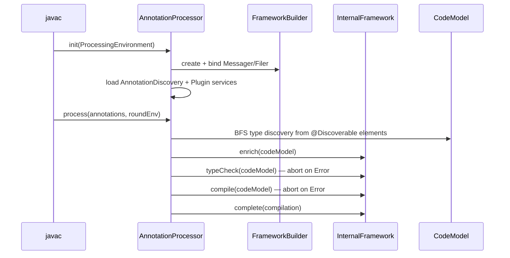
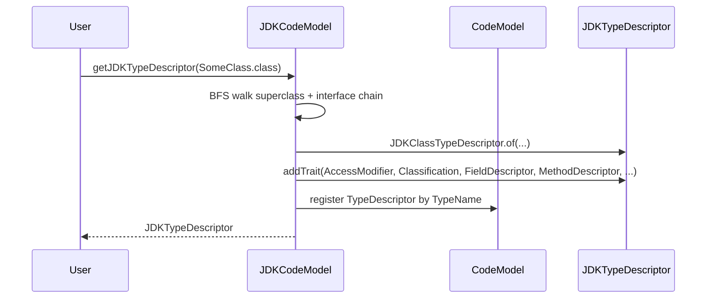
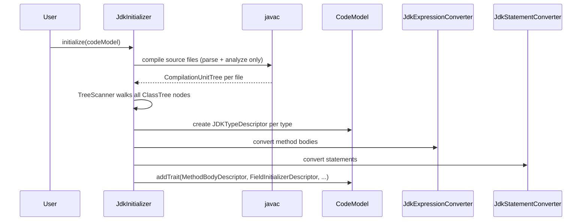
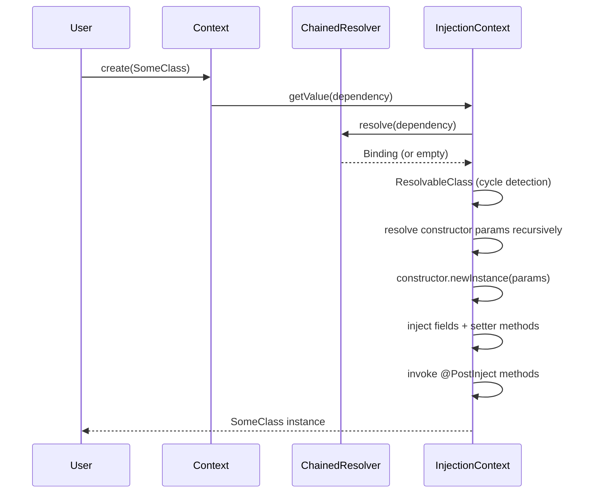

# Codebase Map — `codemodel.build`

> Auto-generated by Cartographer. Last mapped: 2026-04-01

## System Overview

`codemodel.build` is a **language-agnostic, paradigm-neutral Java code model framework** built by Workday, Inc. It provides a structured, serializable representation of software systems that can be inspected, enriched, and transformed. The framework can populate a code model from either compiled classes (via reflection) or `.java` source files (via javac). Downstream consumers use it to build annotation processors, code generators, and static analysis tools.

**Stack:** Java 25 (preview features enabled), Jakarta Inject, Maven, custom marshalling framework, Pratt-parser, JSR-330 DI

```mermaid
graph TB
    subgraph Foundation
        F[codemodel-foundation]
    end
    subgraph Domain Models
        EXPR[expression-codemodel]
        HIER[hierarchical-codemodel]
        IMP[imperative-codemodel]
        OO[objectoriented-codemodel]
    end
    subgraph JDK Integration
        JDK[jdk-codemodel]
        DISC[jdk-annotation-discovery]
        PROC[jdk-annotation-processor]
    end
    subgraph Framework
        FW[codemodel-framework]
        FWB[codemodel-framework-builder]
    end
    subgraph DI
        DI[dependency-injection]
    end

    F --> EXPR
    F --> HIER
    EXPR --> IMP
    HIER --> OO
    IMP --> OO
    OO --> JDK
    JDK --> DI
    FW --> FWB
    DI --> FWB
    JDK --> PROC
    FWB --> PROC
    DISC --> PROC
```

---

## Directory Structure

```
codemodel.build/
├── codemodel-foundation/          # Core abstractions: TypeDescriptor, TypeUsage, Trait system, naming
├── expression-codemodel/          # Expression AST nodes + operator-precedence parser
├── hierarchical-codemodel/        # Type hierarchy: parent/child/ancestor/descendant
├── imperative-codemodel/          # Statement AST nodes: Block, If, While, Return, Assignment
├── objectoriented-codemodel/      # OOP traits: fields, methods, constructors, access modifiers
├── jdk-codemodel/                 # JDK-backed impl: reflection + javac source parsing + AST conversion
├── dependency-injection/          # Custom JSR-330 DI implementation built on jdk-codemodel
├── codemodel-framework/           # Pipeline interface: Enricher, TypeChecker, Compiler, Completer
├── codemodel-framework-builder/   # Concrete pipeline: FrameworkBuilder, InternalFramework
├── jdk-annotation-discovery/      # SPI: AnnotationDiscovery + @Discoverable annotation
├── jdk-annotation-processor/      # javax.annotation.processing.Processor driving the full pipeline
├── config/checkstyle/             # Google Checkstyle config
└── pom.xml                        # Root aggregator POM (Java 25, version ${revision})
```

---

## Module Guide

### `codemodel-foundation`

**Purpose:** The substrate for everything else. Provides the `CodeModel` registry, `TypeDescriptor`/`ModuleDescriptor`/`NamespaceDescriptor` model nodes, the `Trait`/`Traitable` system for extensible metadata, all naming types, and marshalling conventions.

**Entry point:** `build.codemodel.foundation.CodeModel`

**Key files:**

| File | Purpose |
|------|---------|
| `CodeModel` | Root registry: creates/queries `TypeDescriptor`s, `ModuleDescriptor`s, `NamespaceDescriptor`s |
| `AbstractCodeModel` | `ConcurrentHashMap`-backed impl with `HeapBasedCompositeIndex` for `Queryable.match()` |
| `ConceptualCodeModel` | Default concrete impl; `@Inject`-annotated ctor; self-registers with `Marshalling` |
| `CodeModelTraitable` | Internal trait bag: enforces `@Singular`/`@NonSingular` cardinality, indexes into `HeapBasedCompositeIndex` |
| `TypeDescriptor` | Named-type definition node; `Traitable` + `Dependent` |
| `PolymorphicTypeDescriptor` | Default open type descriptor; all semantics from traits |
| `TypeUsage` | Type reference node (how a type is *used*); hierarchy of 11 concrete types |
| `AnnotationTypeUsage` | Annotation usage; also a `Trait`, allowing annotations on any `TypeUsage` |
| `TypeName` | Fully qualified type identifier; format `[module/][namespace.]simpleName` or `[enclosingType:]...` |
| `NameProvider` | Factory/flyweight for all name value objects; `CachingNameProvider` wraps `NonCachingNameProvider` |
| `CallableDescriptor` | Trait interface for method/function definitions on a `TypeDescriptor` |
| `FormalParameterDescriptor` | Single parameter of a `CallableDescriptor` |
| `Trait` / `Traitable` | Core trait system interfaces; `@Singular`/`@NonSingular` cardinality annotations |
| `TypeUsagePattern` | Structural pattern-matching DSL for `TypeUsage` trees |
| `transport/*` | `Transformer` impls bridging naming types ↔ `String` for serialization |

**Key design patterns:**
- **Trait system:** Everything is a `Trait` on a `Traitable`. The `CodeModelTraitable` uses `@Singular`/`@NonSingular` annotations on trait class hierarchies to enforce cardinality. JVM-global static caches store registration metadata once.
- **Marshalling convention:** All serializable classes have: private ctor, `@Unmarshal` ctor, `@Marshal destructor(...)`, and `static { Marshalling.register(...) }`.
- **`Lazy<TypeUsage>`:** Parameters use `Lazy` wrappers to support forward references during model construction.

**Dependencies:** `build.base:{base-foundation, base-mereology, base-query, base-marshalling, base-transport, base-telemetry}`, `jakarta.inject`

**Gotchas:**
- `TypeDescriptor.parents()` throws `IllegalStateException` if a parent's descriptor isn't yet registered — use `parentTypeUsages()` for safe partial-model traversal.
- `CodeModelTraitable` static caches are permanent — trait class registration is JVM-global and never cleared.
- `getTrait(Class)` throws `IllegalArgumentException` if >1 trait of that class exists; `trait(Class)` throws `NoSuchElementException` if 0 exist. Know which you need.
- `GenericTypeUsage.equals()` has a `TODO`: parameter comparison is not implemented.
- Duplicate `Marshalling.register` static blocks exist in `PolymorphicTypeDescriptor` and `ConceptualCodeModel` — harmless (idempotent) but a copy-paste artifact.

---

### `expression-codemodel`

**Purpose:** Expression AST nodes for arithmetic, logical, comparison, and template expressions, plus an extensible operator-precedence (Pratt-style) parser.

**Entry points:** `build.codemodel.expression.Expressions` (factory facade), `build.codemodel.expression.parsing.ExpressionParser`

**Key files:**

| File | Purpose |
|------|---------|
| `Expression` | Root interface: `Optional<TypeUsage> type()`, extends `Traitable` |
| `AbstractExpression` | Base class; type resolved via `ExpressionType` trait |
| `AbstractLogicalExpression` | Hardwires `type()` → `Boolean` in normal ctor (not in `@Unmarshal` ctor) |
| `Addition`/`Subtraction`/etc. | Binary arithmetic (extend `AbstractBinaryArithmeticExpression`) |
| `Conjunction`/`Disjunction`/etc. | Binary logical (AND, OR, XOR, implication) |
| `EqualTo`/`LessThan`/etc. | Comparison operators; also `AnyInCommon`, `NoneInCommon` for set checks |
| `Negation` | Unary NOT |
| `BooleanLiteral`/`NumericLiteral`/`StringLiteral` | Typed literals; `Literal<T>` base is not directly marshallable |
| `VariableUsage` | Named variable reference |
| `FunctionUsage` | Function call site; `type()` always `Optional.empty()` |
| `FunctionDescriptor` | Function definition (return type, formal parameters) |
| `Cast` | Explicit type cast; `type()` returns `targetType` |
| `TemplateExpression` | String template: list of interleaved expressions |
| `Expressions` | Fluent factory/service facade over a `CodeModel` |
| `ExpressionParser` | Configurable Pratt parser; register atoms, unary, binary, sections before calling `parse()` |
| `TemplateParser` | Variant for template strings; no operator support; merges adjacent `StringLiteral`s |
| `ExpressionStackManager` | Operator-precedence stack; higher priority int = looser binding |
| `TokenParser` / `Tokenizer` | Token extraction layer; parser order matters (first match wins) |

**Key design pattern:** No built-in operators — all operators and atoms must be registered with `ExpressionParser` before parsing. The test suite demonstrates the canonical registration set.

**Dependencies:** `codemodel-foundation`, `build.base:{base-parsing, base-marshalling, base-foundation}`

**Gotchas:**
- `BinaryArithmeticExpression` and `UnaryArithmeticExpression` extend `LogicalExpression` — counter-intuitive hierarchy.
- `AbstractLogicalExpression` only hardwires the `Boolean` type in the normal ctor; round-tripped expressions via `@Unmarshal` may lack a type.
- `TemplateExpression.of(List)` throws `NoSuchElementException` on empty list — use `TemplateExpression.empty(CodeModel)`.
- `ExpressionStackManager`: higher `int` = lower binding priority (inverted from usual convention). `SectionEnd` uses `9999`.

---

### `hierarchical-codemodel`

**Purpose:** Adds parent-child type hierarchy to the code model: ancestors, descendants, assignability, diamond-pattern detection.

**Entry point:** `build.codemodel.hierarchical.HierarchicalCodeModel`

**Key files:**

| File | Purpose |
|------|---------|
| `HierarchicalCodeModel` | Extends `CodeModel`; adds `roots()`, `isAssignable()`, `getAssignableTypeDescriptors()` |
| `AbstractHierarchicalCodeModel` | `ConcurrentHashMap`-indexed parent/child/orphan relationships; notified via `TraitAware` hooks |
| `HierarchicalTypeDescriptor` | Rich default-method API: `parents()`, `children()`, `ancestors()`, `descendants()`, `level()`, `isAssignableTo()`, `formsDiamondPattern()` |
| `AbstractHierarchicalTypeDescriptor` | Implements `TraitAware`; hooks `onAddedTrait`/`onRemovedTrait` to notify the code model index |
| `ParentTypeDescriptor` | `Trait` interface holding a `NamedTypeUsage` for a parent type |

**Dependencies:** `codemodel-foundation`, `build.base:{base-foundation, base-marshalling}`

**Gotchas:**
- `parents()` throws if parent descriptor isn't registered yet; use `parentTypeUsages()` during partial model construction.
- `formsDiamondPattern()` calls `parents().count()` twice (two terminal stream operations) — slightly inefficient.
- `level()` is computed recursively with no cycle detection — circular hierarchies cause `StackOverflowError`.

---

### `imperative-codemodel`

**Purpose:** Statement AST nodes for imperative control flow, usable as method bodies in the code model.

**Entry points:** `build.codemodel.imperative.Block`, `build.codemodel.imperative.Statements`

**Key files:**

| File | Purpose |
|------|---------|
| `Statement` | Marker interface extending `Traitable` |
| `AbstractStatement` | Base; provides marshal/unmarshal infrastructure |
| `Block` | Sequence of `Statement`s; `Block.empty(codeModel)`, `Block.of(stmts...)` |
| `If` | `condition`, `thenStatement`, `Optional<Statement> elseStatement` |
| `While` | `condition` + body |
| `Return` | Wraps an `Expression` |
| `Assignment` | Assigns an `Expression` to a `VariableUsage` |
| `Statements` | Convenience factory wrapping a `CodeModel` |

**Dependencies:** `codemodel-foundation`, `expression-codemodel`, `build.base:base-marshalling`

**Gotchas:**
- `Block.of(stmts...)` requires ≥1 statement; use `Block.empty(codeModel)` for zero-statement blocks.
- Statements derive `CodeModel` from `expression.codeModel()` — if the expression has no `CodeModel`, NPE before null check fires.

---

### `objectoriented-codemodel`

**Purpose:** OOP concepts as traits: class/interface type descriptors, fields, methods, constructors, access modifiers, classification, parameterized types, and OOP expression usages (`this`, `super`, method calls).

**Entry point:** `build.codemodel.objectoriented.ObjectOrientedCodeModel`

**Key files:**

| File | Purpose |
|------|---------|
| `ObjectOrientedCodeModel` | Extends `AbstractHierarchicalCodeModel`; the primary OOP model container |
| `ClassTypeDescriptor` / `InterfaceTypeDescriptor` | Concrete type descriptors extending `AbstractHierarchicalTypeDescriptor`; structurally identical, semantically distinct |
| `AccessModifier` | `@Singular` `Trait` enum: `PUBLIC`, `PROTECTED`, `PRIVATE` |
| `Classification` | `Trait` enum: `ABSTRACT`, `CONCRETE`, `FINAL`; has `isAbstract()` |
| `FieldDescriptor` | `Trait`: `IrreducibleName` + `TypeUsage`; implements `Dependent` |
| `MethodDescriptor` | `CallableDescriptor` impl: owner, `MethodName`, return `TypeUsage`, parameters; generates `signature()` |
| `ConstructorDescriptor` | `CallableDescriptor` impl: return type and `MethodName` auto-derived from owning `TypeDescriptor` |
| `ParameterizedTypeDescriptor` | `Trait`: list of `TypeVariableUsage`s; implements `Dependent` |
| `ExtendsTypeDescriptor` / `ImplementsTypeDescriptor` | Extend `AbstractParentTypeDescriptor`; model class extension and interface implementation |
| `MethodUsage` / `ThisUsage` / `SuperUsage` | `Expression` subtypes in the `descriptor` package (package placement is surprising) |
| `MethodName` | `CallableName` impl: fully qualified method name |

**Dependencies:** `hierarchical-codemodel`, `expression-codemodel`, `imperative-codemodel`, `codemodel-foundation`, `build.base:{base-foundation, base-marshalling, base-transport}`

**Gotchas:**
- `ConstructorDescriptor.of(TypeDescriptor)` auto-derives `MethodName` and return type — you cannot override them.
- `MethodDescriptor.signature()` includes the class name prefix only for `PRIVATE` methods.
- `MethodUsage`, `ThisUsage`, `SuperUsage` are `Expression`s living in the `descriptor` package — surprising placement.

---

### `jdk-codemodel`

**Purpose:** JDK-backed code model implementation. Two independent paths: (1) `JDKCodeModel` populates via `java.lang.reflect` at runtime; (2) `JdkInitializer` populates via javac source parsing. Both produce `JDKTypeDescriptor`s in a shared `CodeModel`.

**Entry points:** `build.codemodel.jdk.JDKCodeModel`, `build.codemodel.jdk.JdkInitializer`

**Key files:**

| File | Purpose |
|------|---------|
| `JDKCodeModel` | Reflection-backed `ObjectOrientedCodeModel`; pre-populates primitives, wrappers, `String`, `Object`, `Optional`, `Stream`, `Throwable`, etc.; BFS type hierarchy walking |
| `JdkInitializer` | Source-parsing `Initializer`; invokes javac, walks `ClassTree`s via `TreeScanner`; single-use (throws on second call) |
| `JdkExpressionConverter` | `SimpleTreeVisitor<Expression,Void>`; converts javac `ExpressionTree` → codemodel `Expression` |
| `JdkStatementConverter` | `SimpleTreeVisitor<Statement,Void>`; converts javac `StatementTree` → codemodel `Statement`; cross-wired with expression converter |
| `ImportedTypeNames` | Collision-detecting collector of `TypeName`s for code generation import lists |
| `TypeUsages` | Static utilities: `isBoolean()`, `isGenerated()`, `getJDKTypeName()`, `getVariableTypeDeclaration()`, `getClass(TypeUsage, ClassLoader)` |
| `descriptor/JDKTypeDescriptor` | Interface unifying `JDKClassTypeDescriptor` and `JDKInterfaceTypeDescriptor` |
| `descriptor/Static` / `Final` / `EnumType` / `RecordType` / `AnnotationType` | Singleton enum `Trait`s for JDK-specific type modifiers |
| `descriptor/JDKType` | `@Singular` `Trait` holding the raw `java.lang.reflect.Type` |
| `descriptor/MethodType` / `ConstructorType` / `FieldType` | `Trait`s holding raw reflection objects |
| `descriptor/MethodBodyDescriptor` | `Trait` holding a parsed `Block` (method body AST) |
| `descriptor/FieldInitializerDescriptor` | `Trait` holding a parsed `Expression` (field initializer) |
| `descriptor/EnumConstantDescriptor` / `RecordComponentDescriptor` | `Trait`s for enum constants and record components |
| `descriptor/EnclosingTypeDescriptor` | `Trait` holding the enclosing `TypeName` for inner classes |
| `expression/` | 19 JDK-specific expression node classes (ArrayAccess, BitwiseBinary, FieldAccess, Identifier, Lambda, MethodInvocation, MethodReference, etc.) |
| `statement/` | 15 JDK-specific statement node classes (Assert, Break, CatchClause, For, EnhancedFor, LocalVariableDeclaration, Synchronized, Try, etc.) |

**Dependencies:** `objectoriented-codemodel`, `codemodel-foundation`, `build.base:*`; `JdkInitializer` additionally requires `javax.compiler` and the private `jdk.compiler` module.

**Gotchas:**
- `JdkInitializer` requires a full JDK (`ToolProvider.getSystemJavaCompiler()`); fails silently on JRE-only installations.
- `JDKCodeModel` uses `ThreadLocal` to guard against infinite recursion on self-referential generic bounds (e.g., `T extends Comparable<T>`).
- `WildcardType` lower/upper bounds are TODO — always becomes `WildcardTypeUsage` with no bounds.
- `LocalVariableDeclaration` and `CatchClause` store types as raw source-form strings, not resolved `TypeUsage` objects.
- `Lambda` does not capture parameter names/types.
- `JdkExpressionConverter.visitAssignment` maps plain `=` to `CompoundAssignment` with operator `"ASSIGNMENT"`.
- Operator names use raw `Tree.Kind.toString()` values (e.g., `"LEFT_SHIFT"`), not symbolic operators.

---

### `dependency-injection`

**Purpose:** Custom JSR-330 (Jakarta DI) implementation built on `JDKCodeModel`. No Spring/Guice/CDI — full from-scratch implementation via runtime reflection through the code model.

**Entry points:** `build.codemodel.injection.InjectionFramework`, `build.codemodel.injection.Context`

**Key files:**

| File | Purpose |
|------|---------|
| `InjectionFramework` | Bootstrap: creates `Context`s, builds/caches `InjectableDescriptor`s, inspects injection points |
| `Context` | Primary user-facing DI container: `create(Class)`, `inject(object)`, `bind(Class)`, `addResolver(...)`, `newContext()` |
| `InjectionContext` | Package-private `Context` impl: binding store (`ConcurrentHashMap`), resolver chain, resolution + injection logic, cycle detection |
| `InjectableDescriptor` | `Trait` on `JDKTypeDescriptor`: caches all `InjectionPoint`s and `@PostInject` methods per class |
| `Dependency` | Describes an injectable requirement: type + qualifier annotations, `signature()` for equality |
| `InjectionPoint` | Constructor/field/method injection site abstraction |
| `ConstructorInjectionPoint` / `FieldInjectionPoint` / `MethodInjectionPoint` | Concrete injection implementations via `trySetAccessible()` |
| `Binding<T>` | Associates a `Dependency` with a value strategy |
| `ValueBinding` / `SingletonValueBinding` / `SupplierBinding` | Direct-value bindings |
| `ClassBinding` / `LazySingletonClassBinding` / `NonSingletonClassBinding` | Class-instantiation bindings |
| `Resolver<T>` | `@FunctionalInterface`: `Optional<Binding<T>> resolve(Dependency)` |
| `ChainedResolver` | Chain-of-Responsibility over `CopyOnWriteArrayList<Resolver>` |
| `ConfigurationResolver` | Resolves `Configuration` / `Option` dependencies |
| `DefaultOptionResolver` | Fallback for `@Default`-annotated `Option` factories (ctor/method/field) |
| `OptionalResolver` | Resolves `Optional<T>` injection points |
| `ProviderResolver` | Resolves `jakarta.inject.Provider<T>` injection points |
| `ProvidesResolver` | Resolves `@Provides`-annotated no-arg methods on a provider object |
| `QualifiedResolver` | Annotation-predicate-based resolution |
| `SystemPropertyResolver` | `@SystemProperty("key")` injection from `System.getProperties()` |
| `PostInject` / `Provides` / `SystemProperty` | Custom annotations |
| `BindingBuilder` / `AbstractBindingBuilder` / `Binder` | Fluent binding DSL |
| `InjectionException` hierarchy | `InjectionFailedException`, `UnsatisfiedDependencyException`, `BindingAlreadyExistsException`, `CyclicDependencyException` |

**Supported JSR-330 features:** Constructor/field/setter injection (`@Inject`), `@Singleton`, `@Qualifier`/`@Named`, `Provider<T>`, superclass injection ordering, method override suppression.

**Dependencies:** `jdk-codemodel`, `objectoriented-codemodel`, `codemodel-foundation`, `jakarta.inject`, `build.base:{base-foundation, base-configuration}`

**Gotchas:**
- `addBinding` throws `BindingAlreadyExistsException` on duplicate — bindings are never silently overwritten.
- `UnsatisfiedDependencyException` 3-arg constructor drops the `Throwable cause` (likely a bug).
- `ProviderResolver` is NOT registered by default — must be added explicitly via `context.addResolver(ProviderResolver::new)`.
- `ProvidesResolver` only handles no-arg `@Provides` methods; methods with parameters are silently skipped.
- `@PostInject` methods use `setAccessible(true)` — will fail under strict module access.
- Cycle detection happens in `ResolvableClass` constructor; `CyclicDependencyException` is thrown before any instantiation.

---

### `codemodel-framework`

**Purpose:** Pure-interface pipeline API — no implementations. Defines the extension point contracts for enriching, validating, and compiling code models.

**Entry points:** `build.codemodel.framework.Framework`, `build.codemodel.framework.Plugin`

**Key files:**

| File | Purpose |
|------|---------|
| `Framework` | Central interface: `newCodeModel()`, `enrich()`, `typeCheck()`, `compile()`, `complete()` |
| `Plugin` | Marker interface; all extension points extend this |
| `Targetable<T>` | Extends `Plugin`; `getTargetClass()` via generic type reflection — enables type dispatch |
| `Enricher<T, E>` | Adds `Trait`s to `Traitable`s; `isTraitPermitted()` guards duplicates |
| `Initializer` | Bootstraps a new `CodeModel` |
| `TypeChecker<T>` | Validates a target; errors via `TelemetryRecorder` |
| `Compiler<T>` | Compiles a target; errors via `TelemetryRecorder` |
| `Completer<T>` | Post-compilation finalization; must NOT create new content |
| `Compilation` / `Completion` | Result wrappers for compile and complete stages |

**Dependencies:** `codemodel-foundation`, `build.base:{base-foundation, base-telemetry}`

**Gotchas:**
- `Enricher.isTraitPermitted()` catches `IllegalStateException` from `getTrait()` and returns `true` — could mask logic errors.
- `Targetable.getTargetClass()` only inspects direct generic interfaces; abstract-class intermediaries may prevent discovery.
- `Completer` is documented as "must not create new content" — no compile-time enforcement.

---

### `codemodel-framework-builder`

**Purpose:** Concrete pipeline implementation. `FrameworkBuilder` (fluent builder + DI binder) creates `InternalFramework` instances that execute the 5-stage pipeline with plugin topological sorting.

**Entry point:** `build.codemodel.framework.builder.FrameworkBuilder`

**Key files:**

| File | Purpose |
|------|---------|
| `FrameworkBuilder` | Fluent builder + `Binder`; uses a `JDKCodeModel` + DI `Context` internally for plugin construction |
| `InternalFramework` | Package-private `Framework` impl: topologically sorted plugins, type-indexed lookup map, pipeline execution |

**Pipeline stages (InternalFramework):**
1. **`enrich()`** — fixed-point loop over all `Traitable`s; continues until no new traits are created
2. **`typeCheck()`** — depth-first dispatch to `TypeChecker`s; returns `Optional.empty()` on any `Error`
3. **`compile()`** — depth-first dispatch to `Compiler`s; returns `Optional<Compilation>` or empty on error
4. **`complete()`** — depth-first dispatch to `Completer`s on the `Compilation`

**Plugin ordering:** `@Requires` annotation (from `build.base.mereology`) enables topological sort — dependencies run before dependents.

**Dependencies:** `codemodel-framework`, `dependency-injection`, `jdk-codemodel`, `objectoriented-codemodel`, `build.base:*`, `jakarta.inject`, `com.google.auto.service`

**Gotchas:**
- `FrameworkBuilder` creates a `JDKCodeModel` in its constructor for DI purposes even if you override the `NameProvider` — the actual framework uses a fresh `JDKCodeModel` in `InternalFramework`.
- Plugin lookup indexes by all concrete classes AND all transitive interface types — so `plugins(TypeChecker.class)` finds any plugin implementing `TypeChecker` anywhere in its hierarchy.
- `processTypeDescriptors()` short-circuits if no plugins target `TypeDescriptor` or `Trait` subclasses — ensure `Targetable<T>` generic parameters are correct.

---

### `jdk-annotation-discovery`

**Purpose:** Minimal SPI module. Defines `AnnotationDiscovery` (ServiceLoader SPI) and the `@Discoverable` marker annotation. Ships the built-in `DiscoverableAnnotationDiscovery` implementation.

**Key files:**

| File | Purpose |
|------|---------|
| `AnnotationDiscovery` | SPI: `getDiscoverableAnnotationTypes()` returns annotation classes that trigger code model discovery |
| `Discoverable` | `@Target(TYPE)` `@Retention(RUNTIME)` — marks a type as part of a discoverable code model |
| `DiscoverableAnnotationDiscovery` | `@AutoService(AnnotationDiscovery.class)` impl registering `@Discoverable` |

**Dependencies:** `com.google.auto.service:auto-service-annotations` only — intentionally no `codemodel-*` dependencies.

**Gotchas:**
- `@Discoverable` has `RUNTIME` retention — available both at compile-time (annotation processing) and runtime (reflection).
- Third parties implement `AnnotationDiscovery` to trigger discovery from their own annotations (e.g., `@Entity`, `@Service`).

---

### `jdk-annotation-processor`

**Purpose:** The top-level integration point. A `javax.annotation.processing.Processor` that discovers annotated types, populates a `CodeModel` from `TypeElement`s, then drives the full framework pipeline (enrich → typeCheck → compile → complete).

**Entry point:** `build.codemodel.jdk.processor.AnnotationProcessor`

**Key files:**

| File | Purpose |
|------|---------|
| `AnnotationProcessor` | `@AutoService(Processor.class)`, `@SupportedSourceVersion(RELEASE_25)`; `init()` + `process()` |
| `ElementLocation` | Wraps `javax.lang.model.element.Element` as a `Location` + `Trait` for telemetry |
| `AnnotationMirrorLocation` | Extends `ElementLocation` with `AnnotationMirror` precision |
| `AnnotationValueLocation` | Extends `AnnotationMirrorLocation` with `AnnotationValue` precision |

**Processing flow:**



**BFS discovery:** Starts from `@Discoverable`-annotated `TypeElement`s, transitively follows supertypes, interfaces, field types, method parameter/return types. Attaches `AccessModifier`, `Classification`, `ParameterizedTypeDescriptor`, `ExtendsTypeDescriptor`, `ImplementsTypeDescriptor`, `FieldDescriptor`, `MethodDescriptor`, `ConstructorDescriptor`, `AnnotationTypeUsage`, etc.

**Dependencies:** `jdk-codemodel`, `codemodel-framework-builder`, `jdk-annotation-discovery`, `dependency-injection`, `codemodel-foundation`, `build.base:*`, `jakarta.inject`, `com.google.auto.service`

**Gotchas:**
- `getSupportedAnnotationTypes()` is dynamic (queries loaded `AnnotationDiscovery` services) — empty before `init()`.
- Services are loaded with `AnnotationProcessor.class.getClassLoader()` — required to find annotation-processor-classpath services.
- `CodeModel` and `Framework` are shared across compiler rounds via `Lazy` — types from earlier rounds persist.
- `@SupportedSourceVersion(RELEASE_25)` — Java 25 source only.
- Processor option `codemodel.excluded.types.pattern` accepts a regex to exclude types by canonical name; parse failures are warnings, not errors.

---

## Data Flow

### Reflection-Based Model Population



### Source-Parsing Model Population



### DI Resolution Flow



---

## Conventions

### Marshalling Convention (all modules)

Every serializable class follows this exact pattern:
1. Private/protected constructor for programmatic creation
2. `@Unmarshal`-annotated public constructor — `@Bound` parameters are injected from context (e.g., `CodeModel`)
3. `@Marshal`-annotated `destructor(Marshaller, Out<FieldType>...)` method
4. `static { Marshalling.register(MyClass.class, MethodHandles.lookup()); }`

### Naming Convention

- `TypeName` format: `[module/][namespace.]simpleName` (or `[enclosingType:]...` for nested types)
- Module uses `/` separator; namespace uses `.` separator; enclosing type uses `:` separator
- Primitives are stored with `java.lang.` prefix (e.g., `java.lang.int`, not `int`)

### Trait Cardinality

- `@Singular` — at most one per `Traitable` (e.g., `AccessModifier`, `JDKType`)
- `@NonSingular` — zero or more (e.g., `ImplementsTypeDescriptor`, `FieldDescriptor`)
- Applying both to the same class throws `IllegalStateException` at runtime

### Plugin Discovery

All `Framework` extension points (`Enricher`, `TypeChecker`, `Compiler`, `Completer`, `Initializer`) are discovered via `ServiceLoader`. Use `@AutoService(Plugin.class)` for automatic registration.

### Static Factory + Private Constructor

All model types use `static Type.of(...)` factories with private constructors. Never `new`.

---

## Gotchas (Cross-Cutting)

| Gotcha | Scope |
|--------|-------|
| `@Unmarshal` constructors for `AbstractLogicalExpression` subtypes do NOT hardwire `Boolean` type — round-tripped logical expressions may have `Optional.empty()` type | `expression-codemodel` |
| `JdkInitializer` is single-use — calling `initialize()` twice throws `IllegalStateException` | `jdk-codemodel` |
| `JDKCodeModel` pre-populates primitives, wrappers, `String`, `Object`, `Optional`, `Stream` — these are always present | `jdk-codemodel` |
| `ProviderResolver` is NOT auto-registered in `Context` — add it explicitly | `dependency-injection` |
| `UnsatisfiedDependencyException(Dependency, String, Throwable)` silently drops the `cause` arg | `dependency-injection` |
| Trait class registration metadata is JVM-global static and never cleared | `codemodel-foundation` |
| `level()` on `HierarchicalTypeDescriptor` has no cycle detection — circular hierarchies → `StackOverflowError` | `hierarchical-codemodel` |
| Java 25 + `--enable-preview` required — build fails on JDK < 25 | all modules |
| `AnnotationProcessor.getSupportedAnnotationTypes()` returns empty set before `init()` | `jdk-annotation-processor` |

---

## Navigation Guide

**To add a new type trait:** Create a class implementing `Trait`, annotate with `@Singular` or `@NonSingular`, follow the marshal/unmarshal convention, call `typeDescriptor.addTrait(myTrait)`.

**To add a new expression type:** Extend `AbstractExpression` (or one of its subtype abstract classes), follow the marshal/unmarshal convention, register with `Marshalling.register(...)` in a `static {}` block.

**To add a new statement type:** Extend `AbstractStatement`, follow the same marshalling pattern.

**To add a new DI resolver:** Implement `Resolver<T>`, add it via `context.addResolver(myResolver)`.

**To add a new framework plugin:** Implement `Enricher<T,E>`, `TypeChecker<T>`, `Compiler<T>`, or `Completer<T>`; annotate with `@AutoService(Plugin.class)`; declare `@Requires` ordering if needed.

**To build a new annotation processor using this framework:**
1. Annotate your types with `@Discoverable`
2. Add `jdk-annotation-processor` to your annotation processor path
3. Implement `Plugin` subtypes for your enrichment/compilation logic
4. Register them via `ServiceLoader`

**To serialize/deserialize a `CodeModel`:** Use `build.base.marshalling.Marshalling` — all model types are pre-registered. Requires `base-transport-json` (or another transport) at runtime.

**To query all descriptors with a given trait:** Use `codeModel.match(MyTrait.class)` — backed by `HeapBasedCompositeIndex`.

**To inspect method bodies from source:** Use `JdkInitializer.ofDirectory(Path)`, call `initialize(codeModel)`, then query `methodDescriptor.getTrait(MethodBodyDescriptor.class)`.
